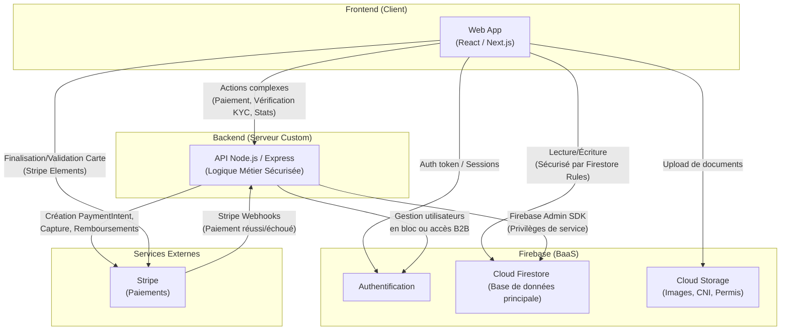
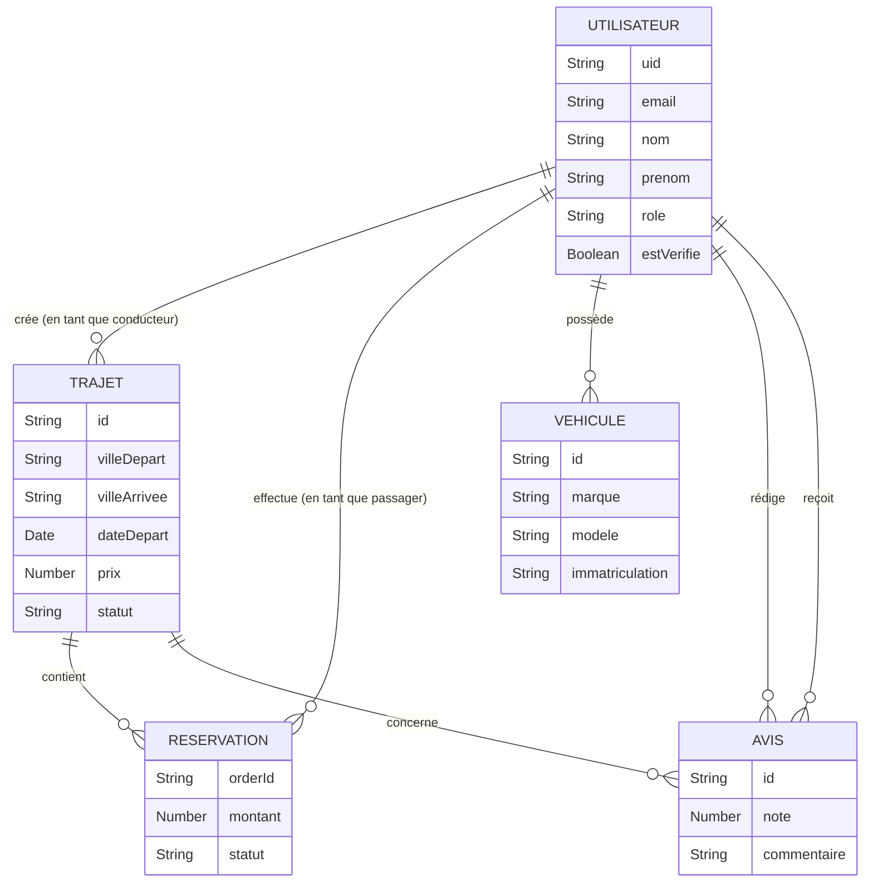
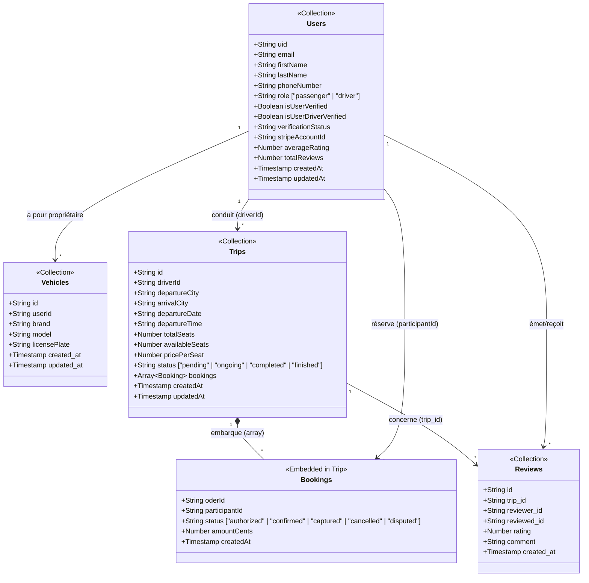

# MDS Startup Landing page

## Table of Contents

- [Project Overview](#project-overview)
- [Architecture](#architecture)
- [Dependencies](#dependencies)
- [Setup and Installation](#setup-and-installation)
- [Running the Project](#running-the-project)

## Project Overview

The Startup landing page is a Next.js-based interface designed for showcasing our features and benefits.

## Architecture

The project is structured as follows:

- **src/**: Contains the main application code
- **Dockerfile.dev**: Dockerfile for development environment.
- **Dockerfile.prod**: Dockerfile for production environment.
- **compose.yml**: Docker Compose file for development.
- **compose.prod.yml**: Docker Compose file for production.

### Globale (Frontend -> Backend)



### Modèle Conceptuel de Données (MCD)

Le MCD représente les entités du système et leurs relations :



### Modèle Physique de Données (MPD) Firestore

Le MPD détaille l'implémentation dans Firestore (Firebase) qui est NoSQL orienté document. Remarquez que les réservations (`Bookings`) sont encapsulées (Embedded Array) dans les trajets (`Trips`).



## Dependencies

To run this project, you need to have the following dependencies installed:

- [Docker](https://www.docker.com/)
- [Docker Compose](https://docs.docker.com/compose/)

## Setup and Installation

1/ **Clone the repository:**

````sh
git clone https://github.com/alexishadjian/rutafem-landing
````

````sh
cd rutafem-landing
````

2/ **Install dependencies:**

````sh
make install
````

3/ **Set up environment variables:**

Copy the .env.sample file to .env.

## Running the Project

### Development

````sh
make up-dev
````

Once the server is running, you can access the application at : `http://localhost:3000`.

### Production

````sh
docker compose -f compose.prod.yml up --build -d
````